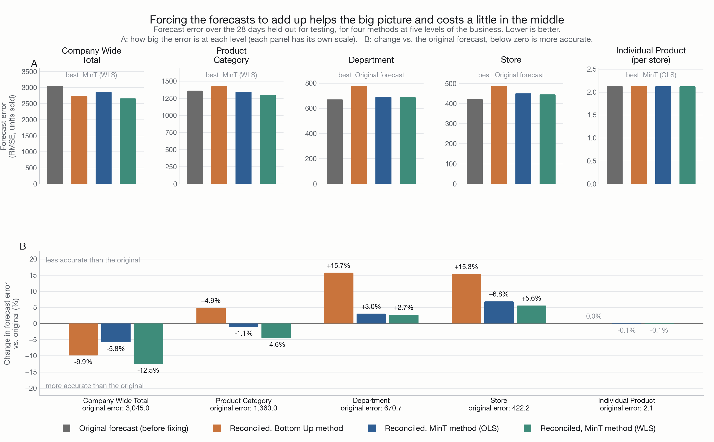
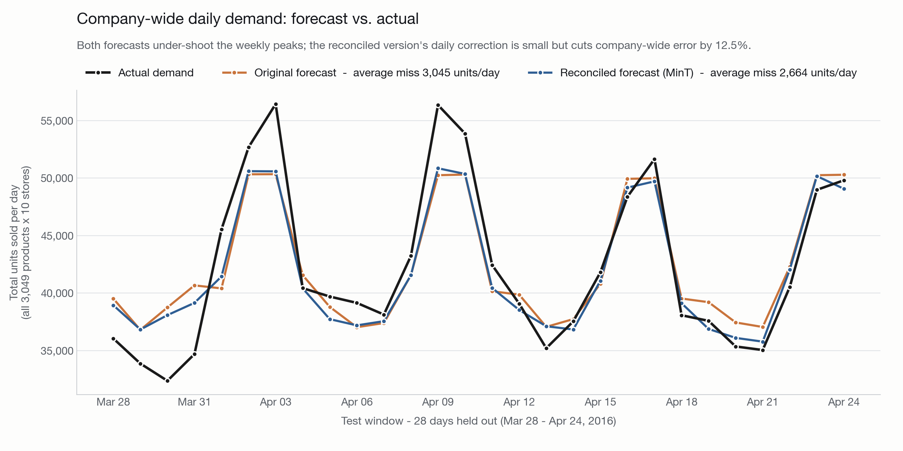

# Hierarchical Demand Forecasting with Coherent Reconciliation

### ▶ **[Open the live dashboard](https://vishesh-ranka.github.io/scm-forecasting-project/)**

*Interactive, no install - charts, glossary and every dropdown run in your browser.*

---

Predicting how many units a retailer will sell - for the company as a whole, for each product category, for each store, and for each individual product in each store - and then adjusting those predictions so they **add up correctly to each other**, which separately-made predictions never do on their own.

Built on the [M5 Walmart dataset](https://www.kaggle.com/competitions/m5-forecasting-accuracy):

- **3,049 products** sold across **10 stores** in 3 US states
- **1,913 days** of daily sales history (2011-01-29 → 2016-04-24, about 5¼ years)
- **58.3 million rows** - one row for every product, in every store, on every day
- **30,511 separate forecasts** produced - one for each thing being predicted, at all five levels

**Stack:** DuckDB · LightGBM · hierarchicalforecast (Nixtla) · SciPy sparse · pandas/NumPy · matplotlib

---

## Contents

- [Glossary](#glossary)
- [The problem](#the-problem)
- [What the pipeline does](#what-the-pipeline-does)
- [Results](#results)
- [Why this was hard](#why-this-was-hard)
- [Reproducing](#reproducing)
- [Repository layout](#repository-layout)

---

## Glossary

*Five terms used throughout this page. Each is defined once here and then used plainly.*

| Term | What it means |
|---|---|
| **Forecast** | A prediction of how many units will sell on a future day. |
| **Base forecast** | The first-draft prediction made for each level separately, before any adjustment. |
| **Hierarchy level** | One altitude of the business: the company total, a product category, a department, a store, or a single product in a single store. |
| **Reconciliation** | Adjusting a set of forecasts so the smaller ones add up exactly to the bigger ones. |
| **Forecast error (RMSE)** | How far off the forecast was, on average, measured in units of product per day. Lower is better. |

---

## The problem

A demand plan gets used at every altitude at once. Finance commits to a company-wide total, category managers plan by category, and the replenishment team orders stock for one product in one store.

If each level is forecast on its own, **those numbers disagree.** The individual-product forecasts don't sum to the category forecast, which doesn't sum to the company total. Someone then reconciles them in a spreadsheet, by hand, and the plan quietly stops being a single plan.

What makes this particular structure hard is that it is not a simple tree:

```
Company Total ──┬── Product Category ── Department ──┐
                │                                    ├── Individual Product per Store
                └── Store ───────────────────────────┘        (30,490 combinations)
```

There are two independent ways to slice the business - by **product** (product → department → category) and by **geography** (store → state). These two paths **cross rather than nest**: every category is sold in every store, so neither slicing is "inside" the other. A single product-in-a-store therefore rolls up through two different chains, not one.

That rules out the simplest fix - taking the company total and splitting it downward - because there is no single path down. It forces methods that work on the whole structure at once.

---

## What the pipeline does

*The five steps, in the order they run. Each writes a file that the next one reads.*

| Step | Script (file to run) | What it produces |
|---|---|---|
| **1. Staging** | `sql/01_staging.sql` | Reshapes the raw spreadsheet-style file (one column per day) into 58.3 million rows of one-row-per-day, with real calendar dates attached |
| **2. Hierarchy** | `sql/02_hierarchy.sql` | Adds up the product-level sales into the 5 business levels (1 company total, 3 categories, 7 departments, 10 stores, 30,490 product-store combinations) |
| **3. Base forecasting** | `src/train_base_forecasts.py` | Makes the first-draft forecasts: a simple "same as last week" benchmark plus a machine-learning model (LightGBM), predicting 28 days ahead |
| **4. Reconciliation** | `src/reconcile_forecasts.py` | Adjusts those forecasts so every level adds up, using two methods (Bottom-Up and MinT) |
| **5. Evaluation** | `src/make_charts.py` | Produces the two charts below |

The final **28 days** of history are hidden from the models and kept aside to test against - 28 days because that is the horizon the original M5 competition scored on.

---

## Results

### Do the forecasts add up?

*Consistency check: do all the smaller forecasts add up correctly to the bigger ones? (0 = perfectly consistent.)*

| Forecast set | Worst gap on any single day | As a share of that day's company-wide sales |
|---|---:|---:|
| **Original Forecast** (before fixing) | 3,449 units | up to 2.5% |
| **Reconciled Forecast** - Bottom-Up method | **0 units** | **0.000%** |
| **Reconciled Forecast** - MinT method (OLS) | **0 units** | **0.000%** |
| **Reconciled Forecast** - MinT method (WLS) | **0 units** | **0.000%** |

Before reconciliation, adding up the individual forecasts gave an answer that differed from the company-wide forecast by as much as **3,449 units of product on a single day** - roughly 1.9–2.5% of that day's sales. After reconciliation the gap is **exactly zero** at every level.

This is a guarantee rather than a lucky result: the reconciled numbers are *built* by summing a single consistent set of product-level figures, so they cannot fail to add up.

### Are the forecasts more accurate?



*This chart compares forecast accuracy across four methods at all five levels of the business. Panel A shows how big the error is at each level; Panel B shows the change against the original forecast. Reconciliation is clearly more accurate for company-wide and category forecasts, and slightly less accurate for departments and individual stores - the normal cost of forcing every level to agree.*

*Lower numbers = more accurate forecasts. Compare the "Original Forecast" column to the "Reconciled Forecast (MinT)" column to see the improvement. All figures are average daily forecast error (RMSE), in units of product per day.*

| Business level | Original Forecast - error (before fixing) | Reconciled Forecast - error (Bottom-Up method) | Reconciled Forecast - error (MinT method) | Change, MinT vs. original |
|---|---:|---:|---:|---|
| **Company-Wide Total** | 3,045.0 units/day | 2,743.4 units/day | **2,663.6 units/day** | **12.5% more accurate** |
| **Product Category** | 1,360.0 units/day | 1,426.2 units/day | **1,297.6 units/day** | **4.6% more accurate** |
| **Department** | **670.7 units/day** | 776.2 units/day | 688.8 units/day | 2.7% less accurate |
| **Store** | **422.2 units/day** | 487.0 units/day | 445.7 units/day | 5.6% less accurate |
| **Individual Product** (per store) | 2.128 units/day | 2.128 units/day | **2.125 units/day** | 0.1% more accurate |

The MinT method improves the top of the business substantially and **costs 2.7–5.6% accuracy in the middle.** Reconciliation moves error around to buy consistency; it does not make every level more accurate at once.

Note how different the scale is at each level: a company-wide forecast misses by roughly 3,000 units on an average day because it is summing millions of units of sales, while a single product in a single store misses by about 2 units a day because it typically sells only a handful. The columns are comparable within a row, not down a column.

Choosing reconciliation is therefore a business decision about which altitude the plan is actually committed at - not a modelling question.



*Daily company-wide sales across the 28 days held out for testing. Both forecasts follow the weekly rhythm (sales peak at weekends) but under-shoot the biggest peaks; the reconciled forecast sits closer to reality on most days, cutting error at this level by 12.5%.*

---

## Why this was hard

### The textbook method does not fit in memory

The standard version of MinT needs a table comparing every product-store combination against every other one. With 30,490 combinations that table is **30,490 × 30,490 entries - about 7.4 GB** - and the mathematics requires effectively inverting it, which is far beyond a laptop.

The version used here exploits the fact that the structure is mostly empty: of the 930 million possible entries in the summing table, only **152,450 are non-zero (0.016% of it)**. Solving it that way takes **0.06 seconds**.

### Negative forecasts cannot simply be deleted

MinT produces **1,280 negative forecasts** (out of 854,308 total) - predictions of below-zero sales, which is impossible. The tempting fix, rounding them up to zero, breaks the adding-up guarantee that reconciliation exists to provide. Genuinely enforcing "never below zero" requires a more expensive constrained calculation.

### Forecasting 28 days ahead is harder than forecasting 1 day ahead

The model uses recent sales as clues - for example, sales 7 days ago. But when predicting 28 days into the future, "7 days ago" is itself a day that has not happened yet. The model therefore feeds its own predictions forward, one day at a time, rather than peeking at the answers.

That this works correctly was verified by replacing the entire hidden test period with random numbers and confirming the forecasts did not change at all - proving the model never saw the answers.

---

## Reproducing

Place the five M5 CSV files (`calendar.csv`, `sales_train_validation.csv`, `sales_train_evaluation.csv`, `sell_prices.csv`, `sample_submission.csv`) in the project root, then:

```bash
pip install duckdb lightgbm hierarchicalforecast pandas numpy scipy matplotlib pyarrow

python3 sql_runner.py                  # steps 1-2: staging + hierarchy   (~42 seconds)
python3 src/train_base_forecasts.py    # step 3: first-draft forecasts    (~105 seconds)
python3 src/reconcile_forecasts.py     # step 4: make them add up         (~2 seconds)
python3 src/make_charts.py             # step 5: charts
```

Total runtime is about **2.5 minutes** on a 10-core laptop.

> **macOS note:** LightGBM needs a library called `libomp`, which macOS does not include. `train_base_forecasts.py` automatically finds the copy bundled with scikit-learn and restarts itself once. Installing it properly (`brew install libomp`) makes that step do nothing.

---

## Repository layout

```
sql/01_staging.sql              reshape raw file into one row per product/store/day
sql/02_hierarchy.sql            add sales up into the five business levels
sql_runner.py                   runs the two SQL steps
src/train_base_forecasts.py     first-draft forecasts (benchmark + LightGBM)
src/reconcile_forecasts.py      makes the forecasts add up (Bottom-Up, MinT)
src/make_charts.py              evaluation charts
data/staged/                    prepared sales data, by level (Parquet files)
data/forecasts/                 forecasts before and after reconciliation (Parquet)
results/                        charts
```
